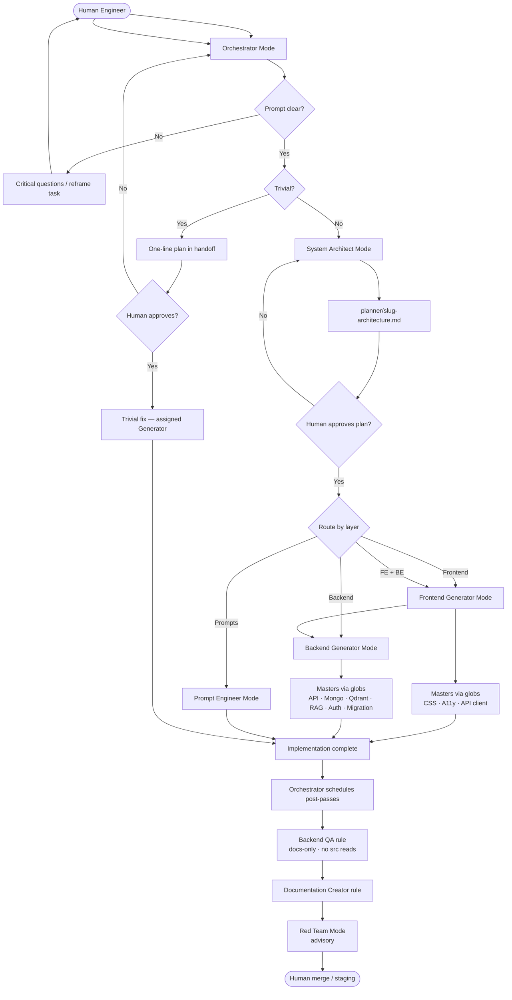
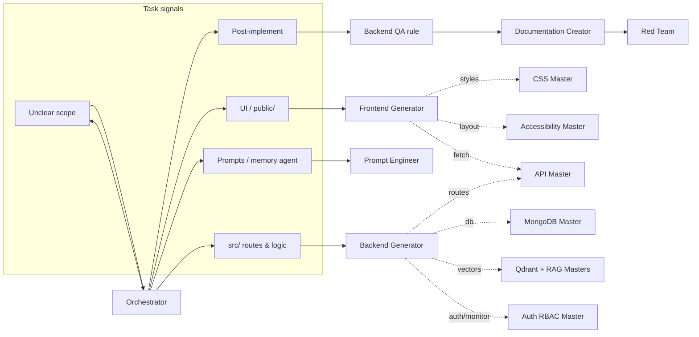

# Custom Modes Setup

Paste each file below into **Cursor → Settings → Chat → Custom Modes → Add mode**.

## Decision flow (modes & rules)

All tasks enter through the **Orchestrator**. It clarifies the prompt, decides the next step, and writes a handoff to `planner/`. **Custom Modes** are roles you switch to in Cursor UI. **Masters** are `.mdc` rules that auto-attach while a Generator edits matching files — they are not separate agents.

### Orchestrator routing (what triggers which mode)

**Legend:** solid arrows = switch Custom Mode or explicit post-pass; dotted arrows = Master rules auto-attach during implementation (no mode switch).

---

Suggested tool permissions:

| Mode | Tools |
|------|-------|
| Orchestrator | Read, search (no edit by default) |
| System Architect | Read, search |
| Frontend Generator | All |
| Backend Generator | All |
| Prompt Engineer | All (scope prompts) |
| Red Team | Read, terminal (curl), search |

Attach rules manually in mode settings where Cursor supports it, or rely on glob auto-attach when editing files.

Rules reference: `../rules/`
