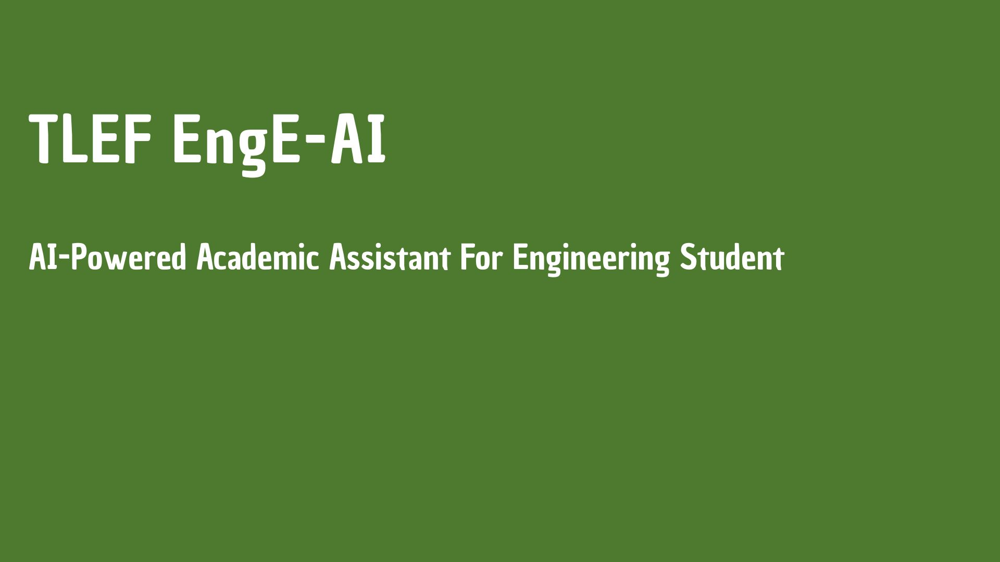

# TLEF ENGE AI


<!--  -->


EngE-AI is an AI-powered learning assistant for UBC Engineering courses which emphasizes on developing student's critical thinking.
---

## Features

### Instructor
- Course creation and management
- Document upload (PDF, DOCX) for RAG
- Learning objectives and materials
- Flags management and responses
- Student chat monitoring
- Assistant and system prompts configuration

### Student
- Course-aware AI chat
- Flag creation ("I'm struggling")
- Flag history
- Access to course materials and objectives

### Technical
- Vector search (Qdrant)
- Streaming chat responses
- Session-based authentication
- MongoDB for courses and users
- Custom UBC Shibboleth SAML 2.0 authentication strategy for Passport.js

---

## Recent Update

<!-- Add recent changes here -->

---

## How to Set It Up

### Prerequisites

- **Node.js** (v18+)
- **MongoDB** (running and accessible)
- **Qdrant** (vector database)
- **LLM endpoint** (e.g. Ollama or other provider)
- **SAML** (optional): IdP metadata, issuer, callback URL for CWL auth. For local development, use [docker-simple-saml](https://github.com/ubc/docker-simple-saml) as a containerized IdP.

### Setup Steps

1. Clone the repo:

   ```bash
   git clone https://github.com/ubc/tlef-engeai.git
   cd tlef-engeai
   ```

2. Install dependencies:

   ```bash
   npm install
   ```

3. Create a `.env` file in the project root (see Environment Variables below).

4. Run the application:
   - **Development:** `npm run dev` (nodemon + BrowserSync)
   - **Production:** `npm start`

### Environment Variables

| Group | Variables |
|-------|-----------|
| **Server** | `TLEF_ENGE_AI_PORT` (default 8020) |
| **MongoDB** | `MONGO_HOST`, `MONGO_PORT`, `MONGO_USERNAME`, `MONGO_PASSWORD`, `MONGO_AUTH_SOURCE`, `MONGO_DB_NAME` |
| **Qdrant** | `QDRANT_URL`, `QDRANT_COLLECTION_NAME`, `QDRANT_VECTOR_SIZE`, `QDRANT_DISTANCE_METRIC`, `QDRANT_API_KEY` (optional) |
| **LLM** | `LLM_PROVIDER`, `LLM_ENDPOINT`, `LLM_DEFAULT_MODEL`, `LLM_API_KEY` |
| **Embeddings** | `EMBEDDING_PROVIDER`, `EMBEDDINGS_ENDPOINT`, `EMBEDDINGS_MODEL` |
| **RAG** | `RAG_CHUNK_SIZE`, `RAG_OVERLAP_SIZE`, `RAG_CHUNKING_STRATEGY`, `RAG_MIN_CHUNK_SIZE` |
| **SAML** | `SAML_AVAILABLE`, `SAML_ISSUER`, `SAML_CALLBACK_URL`, `SAML_ENTRY_POINT`, `SAML_LOGOUT_URL`, `SAML_METADATA_URL`, `SAML_ENVIRONMENT` |
| **Session** | `SESSION_SECRET`, `SESSION_TIMEOUT_MS` |
| **Optional** | `DEBUG`, `DEVELOPING_MODE` (mock LLM), instructor PUID overrides |

---

## Teams

| Role | Name |
|------|------|
| Principal Investigator | [Alireza Bagherzadeh](https://chbe.ubc.ca/s-alireza-bagherzadeh/) — Associate Professor of Teaching, CHBE |
| Co-Investigator | [Amir M. Dehkhoda](https://mtrl.ubc.ca/amir-m-dehkhoda/) — Assistant Professor of Teaching, Materials Engineering |
| Software Developer | [Richard Tape](https://ctlt.ubc.ca/2022/11/15/richard-tape/) |
| Software Developer | Charisma Rusdiyanto |

---

## How to Contribute

1. Fork the repo
2. Create a feature branch
3. Follow existing code style (TypeScript, Express patterns)
4. Submit a pull request

For API reference, see [documentation/ENDPOINT_ARCHITECTURE.md](documentation/ENDPOINT_ARCHITECTURE.md).

---

## Documentation

- [Endpoint Architecture](documentation/ENDPOINT_ARCHITECTURE.md)
- [Responsive Design](documentation/RESPONSIVE_DESIGN.md)
- [docker-simple-saml](https://github.com/ubc/docker-simple-saml) — Containerized SAML 2.0 IdP for local development

---

## Continuous Integration

Pushing to the main branch in this repo will trigger a deploy automatically to the staging server.


license