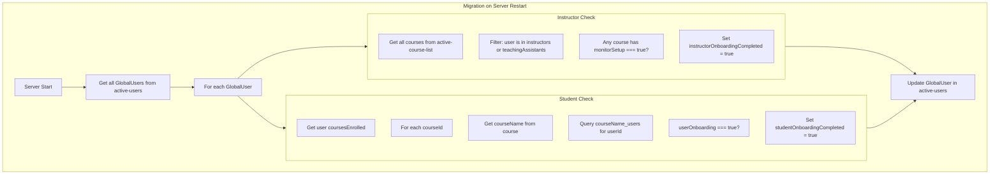
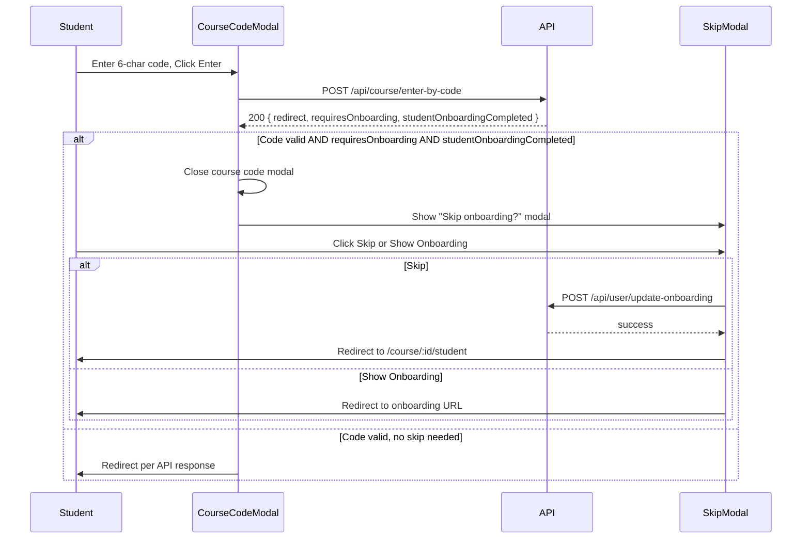

# Onboarding Migration and Student Skip Fix - Implementation Plan

## Summary

1. **Migration function**: A removable, one-time migration that runs on server restart to backfill `instructorOnboardingCompleted` and `studentOnboardingCompleted` on GlobalUser from existing course and CourseUser data.
2. **Student skip modal**: Ensure the skip onboarding notification is displayed only after the 6-character code is successfully validated.

---

## What Went Wrong (Analysis)

### 1. No Backfill for Existing Users

**Problem**: The original implementation only sets `instructorOnboardingCompleted` and `studentOnboardingCompleted` when users complete onboarding *after* the feature was deployed. Existing users who completed onboarding before the deployment have these fields as `undefined`, so they never see the skip option.

**Fix**: Run a migration on server startup that computes these flags from existing data and updates GlobalUser.

### 2. Instructor Onboarding Logic

**Problem**: Instructor onboarding is considered "passed" when the user has completed the **last phase** (monitor setup) on any course where they are an instructor. The migration must derive this from:
- `active-course-list`: courses where `instructors` array contains the user's `userId` AND `monitorSetup === true`.

### 3. Student Onboarding Logic (Including TAs)

**Problem**: A user can be both a student and a TA. Student onboarding is measured by: for each course the user is enrolled in (in `{courseName}_users`), check `userOnboarding`. If **any** CourseUser entry has `userOnboarding === true`, then `studentOnboardingCompleted = true`.

**Fix**: Iterate over `coursesEnrolled` for each GlobalUser, query each `{courseName}_users` for that userId, and OR the `userOnboarding` values.

### 4. Student Skip Modal Timing

**Problem**: The user wants the skip modal to appear "once they have correctly entered the 6character code". The current flow does run the skip logic only after a successful API response. However:
- The course code modal may still be open (with "Entering..." state) when the skip modal appears, causing visual confusion or stacking issues.
- We should explicitly close/dismiss the course code modal before showing the skip modal for clearer UX.

**Fix**: Close the course code modal before showing the skip modal, or ensure the skip modal is clearly visible on top.

---

## Migration Logic (Detailed)



### Migration Pseudocode

```
for each globalUser in active-users:
  instructorPassed = false
  studentPassed = false

  // Instructor: any course where user is instructor/TA and monitorSetup is true
  for each course in active-course-list:
    if userId in course.instructors OR userId in course.teachingAssistants:
      if course.monitorSetup === true:
        instructorPassed = true
        break

  // Student: any CourseUser with userOnboarding true
  for each courseId in globalUser.coursesEnrolled:
    course = getActiveCourse(courseId)
    if !course: continue
    courseUser = find in {course.courseName}_users by userId
    if courseUser && courseUser.userOnboarding === true:
      studentPassed = true
      break

  if instructorPassed or studentPassed:
    updateGlobalUser(puid, { instructorOnboardingCompleted: instructorPassed, studentOnboardingCompleted: studentPassed })
```

---

## Implementation Plan

### Part 1: Migration Function

**File**: `src/helpers/migrate-onboarding-flags.ts` (new file)

1. Create `migrateOnboardingFlags()`:
   - Get MongoDB instance
   - Fetch all GlobalUsers from `active-users`
   - Fetch all courses from `active-course-list`
   - For each GlobalUser:
     - **Instructor**: Check if user's `userId` is in any course's `instructors` or `teachingAssistants` (handle both `InstructorInfo[]` and `string[]` formats) AND that course has `monitorSetup === true`
     - **Student**: For each `courseId` in `coursesEnrolled`, get course, get `{courseName}_users` collection, find document with `userId`, check `userOnboarding === true`
     - If either is true, call `updateGlobalUser(puid, { instructorOnboardingCompleted, studentOnboardingCompleted })`
   - Log counts (users processed, users updated)
   - Idempotent: safe to run multiple times (only sets true, never false)

2. **Removable**: Use env var `RUN_ONBOARDING_MIGRATION=true` to enable. When migration is no longer needed, remove the call and delete the file.

**File**: `src/server.ts`

- After `initInstructorAllowedCourses()`, call `migrateOnboardingFlags()` if `RUN_ONBOARDING_MIGRATION === 'true'`
- Wrap in try/catch; log success or failure

### Part 2: Student Skip Modal - Display After Code Validation

**File**: `public/scripts/entry/course-selection.ts`

**Current flow** (in `handleCourseCodeSubmit`):
1. POST `/api/course/enter-by-code`
2. If `data.error`: show error, re-enable input, return
3. If success and skip conditions: show `showConfirmModal` (skip modal)
4. Redirect

**Issue**: The course code modal (`ModalOverlay`) may still be open when we show the skip modal. The `showConfirmModal` uses a different modal instance. We need to ensure:
1. The skip modal is shown **only after** successful code validation (already the case)
2. The course code modal is closed before showing the skip modal so the user sees a clear transition

**Fix**:
- Before showing the skip modal, close the course code modal. The `ModalOverlay` class has a `close()` or we need to trigger the modal to close. Check `modal-overlay.ts` for how to programmatically close.
- Alternatively: the skip modal may already overlay correctly. Verify the flow and add a comment that the skip modal is intentionally shown after successful validation.
- If the course code modal uses `ModalOverlay.show()` which returns a Promise, the modal stays open until the user interacts. When we call `showConfirmModal`, we're in the same call stack - the course code modal's content (the form) is still visible. The `showConfirmModal` typically creates a new overlay. We should **close the course code modal first** by calling the modal's close method, then show the skip modal. This requires the course code modal to expose a close method or we need to pass a callback.

**Simpler approach**: Store a reference to the course code modal when we create it. When we get a successful response and need to show the skip modal, call `modal.close()` or similar before `showConfirmModal`. Check the ModalOverlay API.

**Alternative**: The `showCourseCodeEntryModal` uses `await modal.show(...)`. The modal stays open until the user closes it (e.g., by clicking a button that resolves the promise). The `handleCourseCodeSubmit` is triggered by the submit button - at that point we're inside the modal. When we `await showConfirmModal(...)`, that will show a new modal. The question is: does the first modal get hidden? Typically modal libraries stack or replace. If they stack, the skip modal appears on top - that might be fine. If the first modal blocks interaction, we need to close it.

**Recommended fix**: Pass the course code `ModalOverlay` instance to `handleCourseCodeSubmit`. When we need to show the skip modal (after successful code validation), call `courseCodeModal.close('success')` first to dismiss the course code modal, then call `showConfirmModal(...)`. This ensures: code validated → course code modal closes → skip modal appears.

**Refactor**: `showCourseCodeEntryModal` creates `const modal = new ModalOverlay()`. Pass `modal` to the submit handler. Update `handleCourseCodeSubmit(code, inputElement, courseCodeModal?)` to accept an optional third parameter. When skip conditions are met, call `courseCodeModal?.close('success')` before `showConfirmModal`.

---

## File Change Summary

| File | Changes |
|------|---------|
| `src/helpers/migrate-onboarding-flags.ts` | **New**. Migration function. |
| `src/server.ts` | Call migration after init if `RUN_ONBOARDING_MIGRATION=true` |
| `public/scripts/entry/course-selection.ts` | Ensure skip modal displays after code validation; close course code modal before skip modal if needed |
| `.env.example` or docs | Document `RUN_ONBOARDING_MIGRATION` (optional, set to `true` to run migration on server start) |

---

## Migration Idempotency and Safety

- **Idempotent**: Running multiple times is safe. We only ever set flags to `true`, never to `false`.
- **Backward compatible**: Users without the flags get them backfilled. Users with flags already set may get redundant updates (no harm).
- **Removable**: Guard with env var. Remove the migration call and file after all users have been migrated and verified.

---

## Sequence Diagram: Student Skip After Code Entry



---

## Solution: Step-by-Step Implementation

### Step 1: Create Migration File

Create `src/helpers/migrate-onboarding-flags.ts`:

```typescript
// For each GlobalUser:
// 1. Instructor: userId in course.instructors or course.teachingAssistants AND course.monitorSetup === true
// 2. Student: For each courseId in coursesEnrolled, find CourseUser in {courseName}_users, OR userOnboarding
// 3. Update GlobalUser with $set (only set true, never false)
```

- Use `instance.db.collection('active-users').find()` for GlobalUsers
- Use `instance.getCourseCollection().find()` for courses
- Helper to extract userId from instructors/teachingAssistants (handle `{userId, name}` and `string` formats)
- For student: `instance.db.collection(\`${courseName}_users\`).findOne({ userId })`

### Step 2: Wire Migration in Server

In `src/server.ts`, after `initInstructorAllowedCourses()`:

```typescript
if (process.env.RUN_ONBOARDING_MIGRATION === 'true') {
  try {
    await migrateOnboardingFlags();
  } catch (err) {
    logger.error('Onboarding migration failed:', err);
  }
}
```

### Step 3: Student Skip Modal - Close Course Code Modal First

In `public/scripts/entry/course-selection.ts`:

1. Change `handleCourseCodeSubmit(code, inputElement)` to `handleCourseCodeSubmit(code, inputElement, courseCodeModal?: ModalOverlay)`
2. In `showCourseCodeEntryModal`, pass `modal` to the submit handler: `handleCourseCodeSubmit(codeInput.value, codeInput, modal)`
3. In `handleCourseCodeSubmit`, when `!data.error` and skip conditions are met, add before `showConfirmModal`:
   ```typescript
   if (courseCodeModal) {
     courseCodeModal.close('success');
   }
   ```
4. Add `ModalOverlay` to imports if needed for the type
