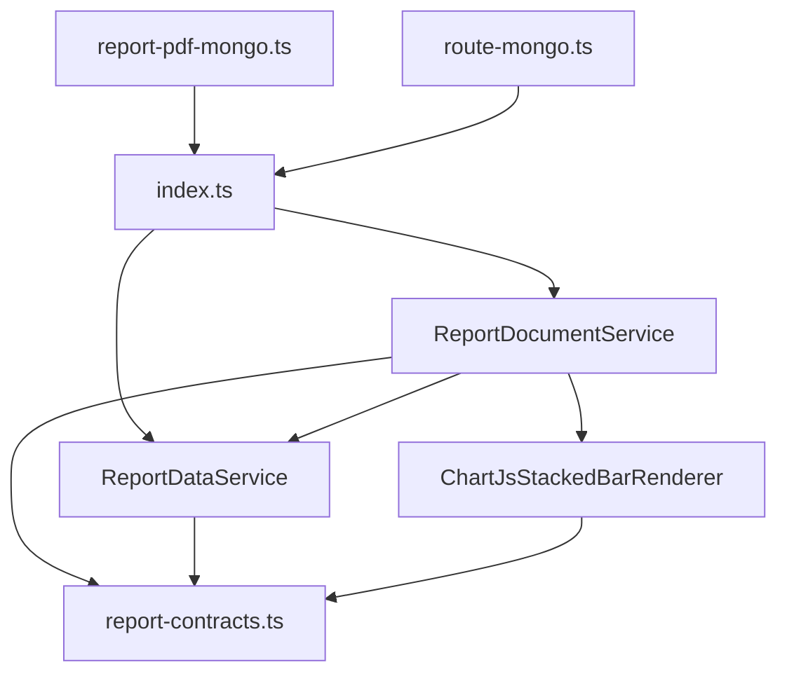

# Report PDF generation

Struggle-topic PDF reports for instructors. Module lives in `src/report-generation/` as **five production files** plus `__tests__/`.

Architecture: **Layered Architecture with Application Services** (Service Layer + Ports & Adapters). Interfaces live in `report-contracts.ts`; each cohesive file exposes one service singleton where appropriate.

## Public API

Import from `src/report-generation` (barrel `index.ts`):

| Export | Module | Used by |
|--------|--------|---------|
| `buildReportPdf` | `report-document.ts` | `report-pdf-mongo.ts` |
| `parseReportPdfPhase` | `report-document.ts` | `report-pdf-mongo.ts` |
| `buildStudentAppendixPdfRows` | `report-data.ts` | `report-pdf-mongo.ts` |
| `contentDispositionAttachmentPdf` | `report-contracts.ts` | `route-mongo.ts` |
| `ReportDocumentService` | `report-document.ts` | PDF orchestration (`getInstance()`) |
| `ReportDataService` | `report-data.ts` | Appendix/legend shaping (`getInstance()`) |
| `ChartJsStackedBarRenderer` | `report-chart.ts` | Chart PNG adapter (`getInstance()`) |

Types: `ReportPdfOutput`, `ReportPdfPhase`, `ReportBuildInput`, `IStackedBarChartRenderer`, `IReportDataService`, `IReportSection`.

Function exports (`buildReportPdf`, `parseReportPdfPhase`, `buildStudentAppendixPdfRows`) are thin wrappers around service singletons — callers may use either style.

## HTTP entry

```
GET /api/courses/:courseId/report.pdf?phase=prototype|full
```

- RBAC: `requireInstructorForCourseAPI`
- Default phase: `prototype`
- Production UI (`report-pdf-download.ts`) requests `phase=full`

## Module layout

```text
src/report-generation/
├── index.ts              # Public barrel
├── report-contracts.ts   # I* interfaces, types, constants, pure helpers (no singleton)
├── report-data.ts        # ReportDataService implements IReportDataService
├── report-chart.ts       # ChartJsStackedBarRenderer implements IStackedBarChartRenderer
├── report-document.ts    # ReportDocumentService + IReportSection page classes + layout
└── __tests__/
```

### Dependency graph



## Runtime flow

1. `route-mongo.ts` → `EngEAI_MongoDB.buildCourseReportPdf(courseId, phase)`
2. `report-pdf-mongo.ts` loads course + `getCourseStruggleStats()`, builds `studentAppendix` via `buildStudentAppendixPdfRows()`
3. `ReportDocumentService.getInstance().buildReportPdf({ course, stats, phase, studentAppendix, generatedAt })`
4. `resolveSections()` returns `IReportSection[]` by phase; `renderReportPdfDocument()` runs PDFKit loop
5. `DistributionPageSection` embeds PNG from `IStackedBarChartRenderer`
6. Response: `application/pdf` + `Content-Disposition` attachment

## Phase behavior

| Phase | Pages rendered |
|-------|----------------|
| `prototype` | Title → Outline → Distribution chart |
| `full` | Same 3 pages + Student Appendix **when** `studentAppendix.length > 0` |

Mongo always builds appendix rows for both phases; only `full` renders the appendix table. Chapter breakdown is listed on the outline page but not implemented yet.

## Application services

Three service singletons follow the same pattern as `EngEAI_MongoDB.getInstance()` and `IDGenerator.getInstance()`:

| Class | Module | Role |
|-------|--------|------|
| `ReportDocumentService` | `report-document.ts` | Orchestrates `IReportSection` page classes; owns default chart renderer |
| `ReportDataService` | `report-data.ts` | Appendix rows and legend/chapter formatting (`IReportDataService`) |
| `ChartJsStackedBarRenderer` | `report-chart.ts` | Reuses one `ChartJSNodeCanvas` (~720×360) per process |

**Page sections** (implement `IReportSection` in `report-document.ts`): `TitlePageSection`, `OutlinePageSection`, `DistributionPageSection`, `StudentAppendixSection`. Phase registry (`resolveSections`) uses Strategy-style selection by `ReportPdfPhase`.

**Concurrency:** `ChartJsStackedBarRenderer.render()` serializes calls on a promise-chain mutex so concurrent HTTP PDF requests do not overlap on the same canvas.

**Not singletons:** `report-contracts.ts` (interfaces and pure helpers only). Each PDF build still creates a fresh `PDFDocument` instance.

**Tests:** Inject `IStackedBarChartRenderer` via `buildReportPdf(input, mockRenderer)`; do not construct `ChartJsStackedBarRenderer` directly (constructor is private).

## Design rules for contributors

1. **Keep five production files** — do not add micro-files unless `report-document.ts` exceeds ~900 lines (e.g. future chapter breakdown); then split appendix layout only.
2. **Data vs render** — shape stats into PDF rows in `ReportDataService`; draw in `ReportDocumentService` section classes.
3. **Chart isolation** — Chart.js canvas stays in `report-chart.ts`; use `ChartJsStackedBarRenderer.getInstance()` in production; inject `IStackedBarChartRenderer` in tests.
4. **Sections as classes** — implement `IReportSection`; register in `resolveSections()`.
5. **No business logic in routes** — Mongo delegate loads data; report module renders.

## Tests

```bash
npm test -- --testPathPatterns=report-generation
```

Layout helpers (`measureAppendixRowContentHeight`, `heightOfChapterGroup`, etc.) are exported from `report-document.ts` for unit tests.
