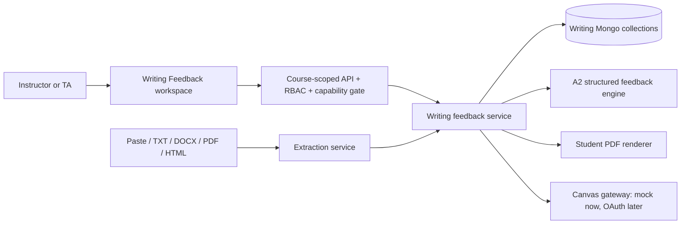

<!--
@author: @rdschrs
@date: 2026-07-23
@version: 1.0.0
@description: System boundaries, data flow, security invariants, and reviewer source map for Writing Feedback.
-->

# Writing Feedback Architecture

## Scope and capability gate

Writing Feedback is an optional, staff-only course capability. `activeCourse.features.writingFeedback.enabled` is false when missing, so all existing courses remain unchanged. Faculty instructors and platform admins configure it; instructors and TAs use the enabled workspace. Disabling the capability hides the navigation item and blocks the APIs, while retaining feedback and audit records.

The workspace keeps configuration and operation separate:

| Action | Instructor / platform admin | TA |
|---|---:|---:|
| View the assignment queue and approved rubric | Yes | Yes |
| Import assignments/submissions after Canvas is configured | Yes | Yes |
| Verify text, review feedback, approve feedback, and preview release | Yes | Yes |
| Enable the course capability or configure a future Canvas connection | Yes | No |
| Create, edit, or approve a rubric version | Yes | No |

Canvas grade permission remains a separate release prerequisite. A staff role inside EngE-AI does not imply that Canvas will accept a grade write.

## Components and boundaries

The submission path does not use RAG ingestion, chunking, embeddings, or Qdrant. Student text is treated as untrusted content, not executable instructions. Paper scans require staff confirmation of an editable transcript before feedback generation.

### Reviewer source map

This map gives a first-time reviewer an intentional reading order. Feature-owned
files carry detailed headers and API contracts; shared application files retain
their original ownership and mark only the Writing Feedback integration seam.

| Read in this order | Files | Responsibility |
|---|---|---|
| 1. Domain vocabulary | `src/writing-feedback/contracts.ts`, `a2-profile.ts`, and the two schema modules | Persistent records, lifecycle states, the fixed A2 seed, rubric validation, and exact-evidence rules |
| 2. Core orchestration | `feedback-engine.ts` and `writing-feedback-service.ts` | Structured model generation, provenance checks, staff revisions, approval, and student-safe PDF preparation |
| 3. Specific comments and PDF | `anchored-comments.ts`, `annotated-text-layout.ts`, and `pdf-service.ts` | UTF-16 anchors, deterministic text layout, sentence-level highlights, and interactive annotation contents |
| 4. Intake and external boundaries | `document-extraction-service.ts`, `canvas-import-*.ts`, `canvas-release-service.ts`, and `job-runner.ts` | Non-RAG extraction, synthetic/not-configured Canvas modes, preview-before-release, and dormant leased-job infrastructure |
| 5. HTTP and persistence | `src/routes/route-writing-feedback.ts` and `src/db/mongo/writing-feedback-mongo.ts` | Course-scoped API orchestration, append-only review history, indexes, deletion rules, idempotency, and leases |
| 6. Staff workspace | `public/scripts/feature/writing-feedback*.ts`, the component HTML, and feature CSS | Assignment queue, rubric editor, verified-text review, anchored comments, PDF modes, release preview, and responsive behavior |
| 7. Regression contract | `src/writing-feedback/__tests__/*.test.ts` and `src/helpers/__tests__/course-features.test.ts` | Executable coverage for the high-risk invariants described above |

The shared integration path then runs through course capability helpers and
mirrored types, course/page/API gates, `EngEAI_MongoDB`, the server mount, and the
instructor shell. Those files are deliberately not owned by this feature.

### Canvas import boundary

The local demonstration and live Canvas integration are intentionally different modes:

- **Local demo mode** lists a small, clearly labelled synthetic Canvas catalog and imports synthetic submissions into the writing collections. It makes no request to Canvas and stores no OAuth token.
- **Not configured** is a first-class state. The UI explains that a scoped institutional connection is required instead of showing a non-working import control.
- **Live mode** remains gated until the institutional privacy/security review, scoped Canvas developer key, encrypted refresh-token storage, sandbox testing, pagination, throttling, and reconciliation behavior are approved and implemented.

After a live course connection exists, instructors and TAs may read the available Canvas assignments and explicitly import a selected assignment. Import reads from Canvas and writes only EngE-AI records. It never creates a Canvas rubric, comment, or grade. Any later Canvas write requires a separate preview and release action.

### Rubric boundary

Every writing assignment has one active, approved rubric and may have one editable draft. The A2 profile seeds approved version 1 for legacy or new local assignments. Instructors and platform admins can create or save the next draft version, review its complete task/audience/purpose/constraints/learning-outcomes/scale definition, and explicitly approve it. TAs can view the approved version but cannot change or approve it.

Saving a draft never changes generation, PDF, or release behavior. Approval promotes a higher version; an approved version is never edited in place. Runs and releases remain attributable to the approved rubric/profile version that governed them. If all four ordinal levels do not have instructor-approved points, numeric release remains blocked.

## Data flow and state

1. Staff lands on an assignment-card list (empty state when no assignments exist) and chooses **Import from Canvas** or **Add assignment (manually)**; each assignment card expands into its submission list where staff paste text or upload a file. Canvas import begins with an explicit integration status and assignment selection; it does not silently import a whole course.
2. Digital extraction produces a staff-verification state; pasted text can be marked verified on intake.
3. Staff confirms the transcript. The feedback engine uses only the current approved rubric and returns evidence-backed rubric suggestions.
4. A staff member reviews two tabs: **General Feedback** (SFL-sectioned rubric evidence, strengths, and up to three revision goals surfaced with Socratic guiding questions) and **Specific Feedback** (comments anchored to exact spans of the verified text). The specific working set seeds from the immutable model run's evidence quotes at read time; staff edit, delete, or add comments by selecting text, and every save appends a review revision snapshotting the full set — the model run itself is never mutated.
5. Anchors use UTF-16 offsets with the quote as checksum. Saves re-validate every anchor against the verified text and reject drifted comments; reads flag drifted comments as `stale` so the UI lists them without mis-anchoring. Re-verifying the transcript after commenting therefore surfaces, rather than silently corrupts, existing comments.
6. A staff member then explicitly approves the submission.
7. The service renders a student-safe PDF (`include=general|annotated|both`; only valid anchors are included, never `origin`, confidence, or staff notes). `general` is the reformatted summary document; `annotated` lays out the verified text with a pure line-layout engine (`annotated-text-layout.ts`) and emits one PDF 1.7 `/Highlight` annotation per comment/page whose `Contents` popup carries the student-safe comment body and whose author (`/T`) is the approving staff name captured at approval (`approvedByName`, fallback "Teaching Team"). Annotation identity, timestamps, subject, and page metadata mirror Canvas exports (`/NM`, `/M`, `/CreationDate`, `/Subj`, `/Page`); the visible highlight band follows the rendered glyph height rather than filling the complete line advance. `both` concatenates the two. A dry-run release preview is created before any release.
8. Only an approved submission with an instructor-approved numeric grade mapping may be released. The local implementation uses a visibly labelled mock Canvas gateway and never writes to Canvas.

`imported → generating → draft_ready → approved → released` is the normal path. `verification_needed` blocks generation; `failed` requires staff attention. No generation action can release work.

The interface also has non-domain states that must not be collapsed into submission status: initial loading, empty queue, integration not configured, import in progress, import complete/skipped, recoverable error, rubric clean, rubric dirty, rubric draft saved, and rubric version approved. These states are shown inline and announced where appropriate; blocking browser alerts are not part of the workflow.

## Collections and retention

Global collections, all keyed by `courseId`, are `canvas-connections`, `writing-assignments`, `writing-submissions`, `writing-feedback-runs`, `writing-releases`, and `writing-jobs`. The data layer creates unique assignment mapping, course/assignment/student/attempt, queue, lease, release-fingerprint, and permitted retention indexes.

`writing-assignments` stores the Canvas mapping, the current approved rubric, and an optional higher-version draft. Approved rubric versions are immutable assessment provenance; draft saves are independent of the active rubric. Re-importing the same Canvas student attempt is idempotent and reports skipped records rather than creating duplicates.

Writing records store internal operational student identifiers only; PUIDs are not written. Student content stays in writing collections. A future `writing-source-files` GridFS bucket is limited to staff-uploaded paper scans needed for transcription review; Canvas originals remain in Canvas.

## Security, privacy, and auditability

- RBAC runs before the feature gate; a capability flag is never an authorization substitute.
- Staff review revisions append rather than replacing the model result.
- Logs must exclude student text, generated feedback, prompt bodies, names, Canvas identifiers, OAuth tokens, and PUIDs.
- The student PDF excludes confidence, flags, model metadata, prompt versions, and internal notes.
- Canvas OAuth needs a scoped developer key, encrypted refresh tokens, throttling, pagination, redirect-safe upload, timeout reconciliation, and duplicate prevention before production use.
- Import and rubric editing never trigger an external Canvas write. Rubric creation/association in Canvas is a future, separately previewed instructor action.

## Rollout

The current local MVP is a fixture/manual vertical slice: A2 profile, a visible synthetic Canvas assignment browser/import, manual/digital intake, an instructor-only versioned rubric editor, verification, structured feedback, staff review, PDF, and mock release preview. Live Canvas OAuth, real grade/comment release, creating or associating rubrics in Canvas, OCR, and bulk leasing are gated by institutional privacy/security review, Canvas sandbox testing, retention approval, and a handwriting benchmark. Future profiles may use curated, authorized, de-identified calibration samples; autonomous self-training is out of scope.
