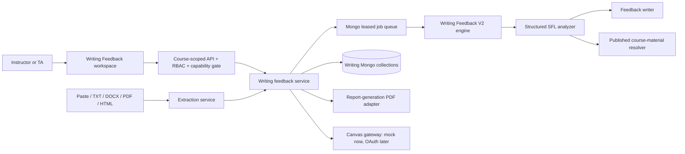

<!--
@author: @rdschrs
@date: 2026-08-24
@version: 1.1.0
@description: System boundaries, data flow, security invariants, and reviewer source map for Writing Feedback.
-->

# Writing Feedback Architecture

## Scope and capability gate

Writing Feedback is an optional, staff-only course capability. `activeCourse.features.writingFeedback.enabled` is false when missing, so all existing courses remain unchanged. Faculty instructors and platform admins configure it; instructors and TAs use the enabled workspace. Disabling the capability hides the navigation item and blocks the APIs, while retaining feedback and audit records.

The workspace keeps configuration and operation separate:

| Action | Instructor / platform admin | TA |
|---|---:|---:|
| View the assignment queue and approved rubric | Yes | Yes |
| Import assignments/submissions after Canvas is configured | Yes | Yes |
| Verify text, review feedback, approve feedback, and preview release | Yes | Yes |
| Enable the course capability or configure a future Canvas connection | Yes | No |
| Create, edit, or approve a rubric version | Yes | Yes |

Canvas grade permission remains a separate release prerequisite. A staff role inside EngE-AI does not imply that Canvas will accept a grade write.

## Components and boundaries

```mermaid
flowchart LR
  Staff[Instructor or TA] --> UI[Writing Feedback workspace]
  UI --> API[Course-scoped API + RBAC + capability gate]
  API --> Service[Writing feedback service]
  Service --> Queue[Mongo leased job queue]
  Service --> Mongo[(Writing Mongo collections)]
  Queue --> Engine[Writing Feedback V2 engine]
  Engine --> Analyzer[Structured SFL analyzer]
  Analyzer --> Writer[Feedback writer]
  Analyzer --> CourseRAG[Published course-material resolver]
  Service --> PDF[Report-generation PDF adapter]
  Service --> Canvas[Canvas gateway: mock now, OAuth later]
  Intake[Paste / TXT / DOCX / PDF / HTML] --> Extract[Extraction service]
  Extract --> Service
```

The submission path does not use RAG ingestion, chunking, embeddings, or Qdrant. Student text is treated as untrusted content, not executable instructions. Writing Feedback V2 may retrieve published course materials only after structured SFL analysis, using assignment/profile/rule labels rather than student text or evidence quotations. Paper scans require staff confirmation of an editable transcript before feedback generation.

### Reviewer source map

This map gives a first-time reviewer an intentional reading order. Feature-owned
files carry detailed headers and API contracts; shared application files retain
their original ownership and mark only the Writing Feedback integration seam.

| Read in this order | Files | Responsibility |
|---|---|---|
| 1. Domain vocabulary | `src/writing-feedback/contracts.ts`, `default-rubric-profile.ts`, `criterion-library.ts`, `sfl-foundation.ts`, and the schema modules | Persistent records, lifecycle states, neutral draft defaults, dynamic rubric/profile validation, curated SFL runtime contracts, and exact-evidence rules |
| 2. Core orchestration | `feedback-engine.ts`, `sfl-analysis.ts`, `course-material-mentions.ts`, `writing-feedback-service.ts`, and `worker.ts` | Two-call SFL analysis/writer generation, analyzer validation, published-material allowlists, async queueing, provenance checks, staff revisions, approval, and student-safe PDF preparation |
| 3. Specific comments and PDF | `anchored-comments.ts`, `src/report-generation/writing-feedback-layout.ts`, and `writing-feedback-report.ts` | UTF-16 anchors, deterministic text layout, sentence-level highlights, and interactive annotation contents |
| 4. Intake and external boundaries | `document-extraction-service.ts`, `canvas-import-*.ts`, `canvas-release-service.ts`, and `job-runner.ts` | Non-RAG extraction, synthetic/not-configured Canvas modes, preview-before-release, and leased-job infrastructure |
| 5. HTTP and persistence | `src/routes/route-writing-feedback.ts` and `src/db/mongo/writing-feedback-mongo.ts` | Course-scoped API orchestration, append-only review history, indexes, deletion rules, idempotency, and leases |
| 6. Staff workspace | `public/scripts/feature/writing-feedback*.ts`, the component HTML, and feature CSS | Assignment queue, rubric editor, verified-text review, anchored comments, PDF modes, release preview, and responsive behavior |
| 7. Regression contract | `src/writing-feedback/__tests__/*.test.ts` and `src/dashboard-setting/__tests__/course-features.test.ts` | Executable coverage for the high-risk invariants described above |

The shared integration path then runs through course capability helpers and
mirrored types, course/page/API gates, `EngEAI_MongoDB`, the server mount, and the
instructor shell. Those files are deliberately not owned by this feature.

### Canvas import boundary

The local demonstration and live Canvas integration are intentionally different modes:

- **Local demo mode** lists a small, clearly labelled synthetic Canvas catalog and imports synthetic submissions into the writing collections. It makes no request to Canvas and stores no OAuth token.
- **Not configured** is a first-class state. The UI explains that a scoped institutional connection is required instead of showing a non-working import control.
- **Live mode** remains gated until the institutional privacy/security review, scoped Canvas developer key, encrypted refresh-token storage, sandbox testing, pagination, throttling, and reconciliation behavior are approved and implemented.

After a live course connection exists, instructors and TAs may read the available Canvas assignments and explicitly import a selected assignment. Import reads from Canvas and writes only EngE-AI records. It never creates a Canvas rubric, comment, or grade. Any later Canvas write requires a separate preview and release action.

### Rubric boundary

Every new writing assignment starts with a neutral, unapproved linguistic rubric draft: three SFL-grounded criteria, four ranked ordinal levels, and an editable SFL context profile. The profile records the staff-approved draft genre/register interpretation: genre label/state, task, purpose, audience, field, tenor, mode, actual evaluator, production conditions, stages, embedded genres, task-object requirements, learning outcomes, and approved glossary terms. The profile is free-form so staff-created assignments, unfamiliar genres, composite genres, and lab reports can be described without forcing a closed enum.

The linguistic rubric/profile cannot govern generation until course staff review and approve both together. The auto-fill operation can propose a profile from assignment instructions and rubrics, but Canvas rubrics and staff edits remain authoritative. After first approval, an assignment has one active rubric/profile and may have one editable next-version draft. Instructors, platform admins, and TAs operate the Writing Feedback workspace once the capability is enabled.

Course staff may shape 1–10 criteria and 2–8 ranked levels, including optional criteria from the library. Criterion/level ids are unique slugs. Criteria and levels may be added or removed after approval because every feedback run records the `rubricVersion` that produced it and resolves its criteria against that saved version through `rubricHistory`; removing a criterion never breaks an existing run. Reuse of a retired id is refused because `AnchoredComment.criterion` carries a bare id with no version, so reuse would silently retag old comments.

Saving a draft never changes generation, PDF, or release behavior. Approval promotes a version; an approved version is never edited in place. Runs and releases remain attributable to the approved rubric/profile version that governed them. If any level lacks instructor-approved points, numeric release remains blocked. Approval replaces `gradeMapping` wholesale or unsets it wholesale.

## Data flow and state

1. Staff lands on an assignment-card list (empty state when no assignments exist) and chooses **Import from Canvas** or **Add assignment (manually)**; each assignment card expands into its submission list where staff paste text or upload a file. Canvas import begins with an explicit integration status and assignment selection; it does not silently import a whole course.
2. Digital extraction produces a staff-verification state; pasted text can be marked verified on intake.
3. Staff confirms the transcript. `POST /generate` validates the verified text, approved rubric, and approved SFL profile, marks the submission `generating`, enqueues only internal ids, and returns `202`.
4. The worker reloads the submission, then runs the linguistic V2 pipeline: structured SFL analyzer; validator for exact evidence, rule/source ids, profile applicability, and observation/interpretation separation; published course-material retrieval from non-student-text labels; and a separate feedback-writer call that evaluates every approved criterion.
5. A staff member reviews two tabs: **General Feedback** (rubric evidence, zero to two strengths, up to three revision priorities, and deduplicated useful course-material labels) and **Specific Feedback** (comments anchored to exact spans of the verified text). The specific working set seeds from the immutable model run's evidence quotes at read time; staff edit, delete, or add comments by selecting text, may attach an approved glossary entry snapshot, and every save appends a review revision snapshotting the full set. The model run itself is never mutated.
6. Anchors use UTF-16 offsets with the quote as checksum. Saves re-validate every anchor against the verified text and reject drifted comments; reads flag drifted comments as `stale` so the UI lists them without mis-anchoring. Re-verifying the transcript after commenting therefore surfaces, rather than silently corrupts, existing comments.
7. A staff member then explicitly approves the submission.
8. The `src/report-generation` adapter renders a student-safe PDF (`include=general|annotated|both`; only valid anchors are included, never `origin`, confidence, or staff notes). `general` is the reformatted summary document; `annotated` lays out verified text with `writing-feedback-layout.ts` and emits one PDF 1.7 `/Highlight` annotation per overlap cluster/page. Complete student-safe comment bodies remain in annotation `Contents`; author fallback and viewer-owned popup behavior remain unchanged. `both` concatenates the two. A dry-run release preview is created before any release.
9. Only an approved submission with an instructor-approved numeric grade mapping may be released. The local implementation uses a visibly labelled mock Canvas gateway and never writes to Canvas.

Release idempotency is keyed by a payload fingerprint that `canvas-release-service.ts` derives from the semantic release payload: submission, feedback run, rubric version, numeric grade, and the staff-approved student narrative. The rendered PDF is deliberately excluded, because each render stamps fresh annotation identifiers and timestamps; hashing those bytes gave identical content a new fingerprint per attempt, so a retry would have duplicated the external write. Including the narrative is equally deliberate: a staff re-approval that edits the student-facing text is genuinely new content and must not collide with the earlier release. Fingerprint derivation belongs to the release coordinator, not the Canvas adapter, so an adapter cannot reintroduce non-deterministic inputs.

`imported → generating → draft_ready → approved → released` is the normal path. `verification_needed` blocks generation; `failed` requires staff attention. No generation action can release work.

The interface also has non-domain states that must not be collapsed into submission status: initial loading, empty queue, integration not configured, import in progress, import complete/skipped, recoverable error, rubric clean, rubric dirty, rubric draft saved, and rubric version approved. These states are shown inline and announced where appropriate; blocking browser alerts are not part of the workflow.

## Collections and retention

Global collections, all keyed by `courseId`, are `canvas-connections`, `writing-assignments`, `writing-submissions`, `writing-feedback-runs`, `writing-releases`, `writing-jobs`, and `writing-glossary-entries`. The data layer creates unique assignment mapping, course/assignment/student/attempt, queue, lease, release-fingerprint, glossary term, and permitted retention indexes.

`writing-assignments` stores assignment instructions, template provenance, the current rubric/profile, and an optional next-version draft. Empty course lists are not auto-seeded. Legacy missing level ranks are added only on detached read values. The Canvas mapping uses a partial unique index that excludes manual rows; startup repairs the former sparse index. Approved rubric/profile versions remain immutable assessment provenance, and repeated Canvas attempts remain idempotent.

`writing-feedback-runs` stores the student-facing result plus immutable V2 provenance: schema, SFL foundation, analyzer prompt, writer prompt, model, validated SFL trace, course-source resolver version, and glossary entry versions. Prompt bodies and student text are excluded from run provenance. Analyzer or writer failure fails linguistic generation without storing a partial run; the technical lens keeps its independent best-effort behavior.

Writing records store internal operational student identifiers only; PUIDs are not written. Student content stays in writing collections. A future `writing-source-files` GridFS bucket is limited to staff-uploaded paper scans needed for transcription review; Canvas originals remain in Canvas.

## Security, privacy, and auditability

- RBAC runs before the feature gate; a capability flag is never an authorization substitute.
- Staff review revisions append rather than replacing the model result.
- Logs must exclude student text, generated feedback, prompt bodies, names, Canvas identifiers, OAuth tokens, and PUIDs.
- Course-material retrieval must not send raw student text, evidence quotations, or generated feedback into RAG.
- The student PDF excludes confidence, flags, model metadata, prompt versions, and internal notes.
- Canvas OAuth needs a scoped developer key, encrypted refresh tokens, throttling, pagination, redirect-safe upload, timeout reconciliation, and duplicate prevention before production use.
- Import and rubric editing never trigger an external Canvas write. Rubric creation/association in Canvas is a future, separately previewed instructor action.

## Rollout

The current local vertical slice supports multiple assignment-specific rubrics, staff-approved SFL context profiles, instructor-approved directions, a visible synthetic Canvas browser/import, manual/digital intake, versioned rubric approval, async generation, structured SFL-founded linguistic feedback, staff review, report-generation PDF output, and mock release preview. LLED 200 is the first named pilot, not a hard-coded system subject. Live Canvas OAuth, real grade/comment release, production OCR, retention policy, real-student evaluation, and governance approval for real student writing remain gated or deferred; do not describe this slice as production-ready.
