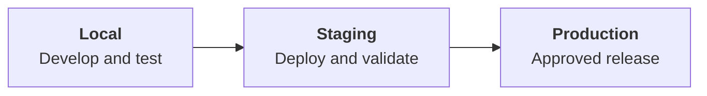

# Scope

EngE-AI is a TypeScript-based application that runs on preconfigured UBC infrastructure and shared development tools. This page explains your responsibilities as a developer, identifies the systems maintained by the project team, and defines the boundaries of your role during development. It covers:

1. Developer Responsibilities
2. Development and Deployment Workflow
3. UBC LTIC’s GenAI Toolkits and Example Applications
4. Out of Scope
5. Recommendations
6. Conclusion

## Developer Responsibilities

EngE-AI runs on infrastructure managed and supported by UBC and the LTIC project team. This infrastructure hosts the application and its supporting services, which include the application server, MongoDB, vector databases, and UBC authentication services.

The project's software infrastructure has been preconfigured and is managed by the project team. Developers are not responsible for managing, modifying, or troubleshooting the infrastructure. Focus on the application code and repository configuration. If an issue appears infrastructure-related, collect the available evidence and report it to your supervisor. As a developer, you are responsible for:

1. **Implementing and maintaining the application code**
   
   Develop features in the project repository and ensure that your code builds and runs on all environments. Use the project's documented Node.js and npm versions to reduce environment-related problems.


2. **Using approved dependencies**
   
   Use dependencies approved by the project team, including UBC LTIC internal libraries. Consult your supervisor before adding a new dependency so that its security, maintenance, and suitability can be assessed.


3. **Explaining and justifying technical decisions**
    
   AI-assisted coding tools can speed up implementation, but developers remain responsible for understanding, testing, and explaining the code they introduce. Document decisions that affect the application’s architecture, dependencies, security, data handling, performance, or long-term maintenance. Consult your supervisor when a technical decision changes the application’s architecture, adds a dependency, affects security or data handling.


## Development and Deployment Workflow

EngE-AI uses three environments to support safe development and release: **Local**, **Staging**, **Production**. Each environment serves different purposes.

Work is developed and tested locally before it is reviewed and merged. Merging an approved pull request automatically deploys the current version to the staging environment. Production environment deployment occurs only after the staged version has been reviewed and approved.



### Local

The local environment is where you develop and internally test changes before sharing them with the team.

During local development, follow these steps:

1. Before implementation, record the problem, the proposed solution, and the expected outcome. See [Agentic Engineering](/docs/logistics/agentic-engineering) for details. This helps other team members review your work and provides useful context for AI-assisted development.

2. Create a new feature branch from the current `main` branch. Do not develop directly on `main`, as it is the shared integration branch.

3. Test your changes before opening a pull request. Run relevant automated tests and perform manual testing for your feature, including edge cases.

4. Ensure the application builds successfully and that your local Node.js and npm versions match the project’s documented requirements.

5. Add diagnostic logging when it will help you investigate a problem. Use `app.logger` instead of `console.log`. `app.logger` is enabled in local and staging environments and disabled in production. See [`logger.ts`](https://github.com/ubc/tlef-engeai/blob/main/src/utils/logger.ts) for details.

6. Do not commit any secret values to the GitHub repository.


Overall, you are responsible for anything inside the repository, including scripts, packages, and environment variables. If your new feature requires new environment variables or deployment configuration, document the required names and purpose for other developers.

### Staging Environment

The staging environment helps identify bugs before a release reaches production. Perform manual testing for the expected user workflow, invalid input, error conditions, and feature-specific edge cases before the feature is released to production.

Use diagnostic logging in staging when it is needed to investigate a defect or verify feature behaviour. Do not log secrets, personal information, or sensitive user content. You may ask your supervisor to provide the latest logs for debugging purposes.

If the feature requires a new or changed environment variable, inform your supervisor. Provide the variable name, its expected format, and its purpose. **DO NOT** include secret values in documentation or the repository.

During staging testing, describe the feature, its expected behaviour, the test cases completed, and any known limitations to your supervisor. Sharing this information with your supervisor creates an opportunity to confirm assumptions and gain multiple perspectives.

After the staged version has passed the agreed manual test cases and any identified issues have been addressed, ask your supervisor to approve deployment to production. After approval, the supervisor deploys the staged version to production.

### Production

The production version is expected to address identified release-blocking bugs and provide a reliable user experience.

Users might still find bugs in the application, even small ones. When a production issue is reported, investigate its likely causes using available evidence and inform your supervisor before applying a fix or rollback.

```developer-note

A bug could be as simple as a typo or an npm package incompatibility.

Hard-to-debug cases could include race conditions or type mismatches. Keep these cases in mind; this is where your judgement is required.

```

Overall, the development and deployment workflow has three environments: Local, Staging, and Production. Each environment supports a different stage of development and quality control.

## UBC LTIC’s GenAI Toolkits and Example Applications

The UBC LTIC group has provided several GenAI toolkits (npm packages) and example applications for many of these toolkits.

### Toolkits

Use UBC LTIC’s GenAI toolkits for major components of the app to avoid malicious or unknown dependencies. Ask your supervisor before using third-party libraries; they may recommend a better approach.

Several GenAI toolkits are provided, including:

1. [**ubc-genai-toolkit-llm**](https://www.npmjs.com/package/ubc-genai-toolkit-llm): Manages conversational structure for multiple LLM providers
2. [**ubc-genai-toolkit-document-parsing**](https://www.npmjs.com/package/ubc-genai-toolkit-document-parsing): Standardized interface for translating document files from PDF, DOCX, and PPT to text
3. [**ubc-genai-toolkit-rag**](https://www.npmjs.com/package/ubc-genai-toolkit-rag): Manages RAG operations, such as chunking and embedding, and stores or connects the resulting embeddings to Qdrant
4. [**Passport-UBC-SHIB**](https://www.npmjs.com/package/passport-ubcshib): Passport.js authentication strategy for UBC SHIB.

### Example app

Example applications are provided for almost every toolkit. Review the relevant example application before implementation to understand how the toolkit is used in practice so you can provide accurate context to an AI-assisted coding tool. The example application is a safe environment for learning and experimentation. Do not treat it as production-ready code.

The example application can be either inside the toolkit’s GitHub repository or in a separate repository. Consult your supervisor for clarification.

## Out of Scope

As a GenAI developer, you should understand the boundaries of your role. You are not responsible for:

- Debugging anything within the infrastructure, such as timeouts or unavailable services
- Developing the toolkits, unless your supervisor asks you to do so
- UBC server maintenance
- Managing LLM API keys or provider credentials. If credentials prevent development, testing, or release, report the issue to your supervisor.
- Managing production secrets, including creating, rotating, distributing, or storing secret values
- Managing service access, billing, subscriptions, or spending limits

If the application runs slowly or becomes unavailable, please investigate whether it is caused by application code, an external dependency, or UBC infrastructure. Collect relevant evidence, such as error messages, logs, reproduction steps, and recent code changes, then share your findings with your supervisor before applying a production fix or rollback.

## Recommendations

As a GenAI developer, you are responsible for building and maintaining EngE-AI’s features reliably and securely while staying within your role's boundaries. This includes following the project workflow, testing changes before release, using approved tools and dependencies, and communicating configuration or infrastructure concerns to your supervisor.


During development, follow these steps:

1. **Confirm the need**

   Determine whether the feature can be implemented using the application’s existing code and dependencies. Do not add a new library if an existing solution meets the requirement.

2. **Check approved UBC LTIC toolkits**

   If a new capability is needed, check whether any approved UBC LTIC toolkits already provide it. Use an approved toolkit if it meets the project’s requirements.

3. **Consult before adding an external dependency**

   If no approved toolkit meets the requirement, consult your supervisor before adding a third-party library, service, or API. Your supervisor can assess the dependency’s security, maintenance, suitability, and long-term impact on the project.

4. **Follow the development workflow**

   Develop the feature on a dedicated branch, test it locally and in staging, and document any important technical decisions or configuration requirements.
