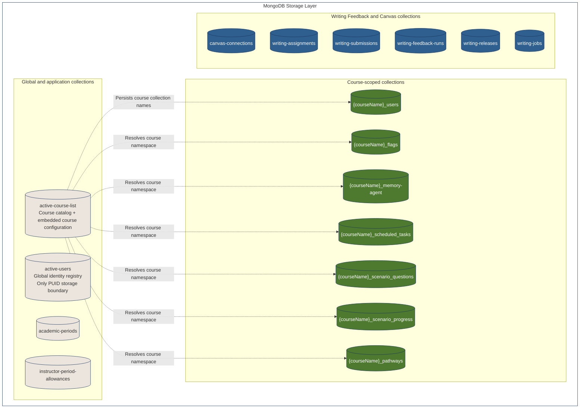

# Databases

```prerequisites

- [Agentic Engineering](/docs/logistics/agentic-engineering)
- [MongoDB sample app](https://github.com/ubc/tlef-mongodb-example-app)
- [Qdrant sample app](https://github.com/ubc/tlef-qdrant-example-app)

```

```relevant sources

- [Main Architecture](/docs/technical-concepts/main-architecture)
- [Database Properties: ACID vs BASE](https://aws.amazon.com/compare/the-difference-between-acid-and-base-database/)

```

This guide explains how EngE-AI stores and organizes application metadata and course data in MongoDB and vectorized content in Qdrant (mainly used for RAG). By the end of this chapter, you are expected to be familiar with:

1. MongoDB
    - MongoDB: Agentic Skills, Implementation, and Testing
    - MongoDB: Collection Organization
    - MongoDB: Essential Properties
2. Qdrant Vector Database
    - Qdrant: Attribute Organization
    - Qdrant: Important Variables
    - Qdrant: Systematic Debugging
3. Migration


## MongoDB

MongoDB is a NoSQL database used by EngE-AI to store non-vectorized application data, including application metadata, courses, users, and conversations. This section explains how MongoDB operations are implemented, tested, and debugged with AI coding tools.

### Agentic Skills, Implementation and Testing

```agent-note

AI-assisted MongoDB development should follow the repository’s existing database rules and patterns. Before implementation, define the problem, identify the affected collections and data fields, inspect the existing MongoDB delegates, and use plan mode to agree on the implementation approach.

The relevant guidance is documented in `03-mongodb-master.mdc` and `MONGO_DATA_LAYER.md`. A coding agent may generate CRUD operations, schemas, and tests, but its output remains a draft. Developers must review the generated code, compare it with existing patterns, and verify the behavior with focused tests.

```

```developer-note 

BSON schemas allow queries to use MongoDB’s native syntax, enabling MongoDB to optimize query execution. As developers, we should critically analyze any AI-agent-generated code to ensure that it is clean, optimized, and follows existing patterns.

You may want to consider these questions when implementing MongoDB operations:

1. Does the query use a BSON schema format? If not, justify the correctness of your implementation.
2. Does the implementation follow best practices for time and space complexity?
3. How large is the content required for CRUD? For large queries, would you prefer incremental changes or one large change?
4. While querying MongoDB, have you used a `try-catch` block to ensure safety? Consider what happens if the MongoDB server is down.
5. How extensive is your test suite? Does it cover all possible cases?

```

EngE-AI uses a façade structure. MongoDB functionality is divided into modular domain components rather than being placed in one large module. This reduces complexity as the implementation grows.

`src/db/enge-ai-mongodb.ts` acts as the entry point and delegates operations to modules under `src/db/mongo/`, such as the academic-period module.

When planning or reviewing a MongoDB change:

1. Identify the affected domain and delegate.
2. Keep the façade responsible for linking public methods to domain logic.
3. Keep domain functionality modular rather than placing it in one large file.
4. Use explicit attribute types in TypeScript interfaces.
5. Clearly distinguish whether an attribute is a string, number, list, or another type.
6. Confirm that the data types are clear enough to support future debugging.

### Collection Organization

EngE-AI organizes MongoDB into three logical groups: global application collections, course-scoped collections, and course-keyed Writing Feedback collections.



Global collections store information shared across courses. These include the course catalog in `active-course-list`, the cross-course identity registry in `active-users`, academic periods, and instructor period allowances. The `active-users` collection is the only collection that stores PUIDs.

Course-scoped collections use the `{courseName}_*` naming pattern to separate users, flags, memory-agent records, scheduled tasks, scenario questions, scenario progress, and pathways for each course. The physical collection names are stored on the course document and resolved through the collection registry. Older courses use deterministic collection-name fallbacks when required.

Writing Feedback uses separate course-keyed collections for Canvas connection metadata, assignments, submissions, feedback runs, releases, and jobs. Student submissions remain in MongoDB and are not sent through the Qdrant course-material pipeline.

Each collection follows a defined document structure to keep records consistent and support safe queries, testing, and migrations.

### Essential Properties

Some MongoDB attributes require explicit handling to preserve consistency and support debugging.

1. **Changeable attributes**
    
    For editable fields such as `item title` and other content, store `createdAt` and `updatedAt` timestamps. These timestamps help track changes and distinguish application errors from infrastructure issues.

2. **Soft deletion**
    
    Soft deletion hides a record from user-facing views without permanently removing it from the database. This preserves data that may be needed for recovery, auditing, or historical reference.

    Use an `isDeleted` attribute, or an equivalent field, to mark records as deleted. The chat feature uses this approach; see `src/db/mongo/chat-mongo.ts`.

## Qdrant Vector Database


Suppose a student asks about one concept in a ten-page course document. Sending the entire document to the LLM would use unnecessary tokens, increase cost and latency, and include information that is not relevant to the question.

EngE-AI addresses this problem using Retrieval-Augmented Generation (RAG), which retrieves relevant information from course materials and feeds it to the LLM as additional context. During document ingestion, EngE-AI parses a course document, divides it into smaller chunks, and stores both the vector representation and the original text in the Qdrant vector database.

When a student asks a question, EngE-AI converts the question into a vector representation, and Qdrant then performs a similarity search to identify the most relevant course-material chunks. The selected chunks are added to the LLM prompt alongside the student’s question, allowing the LLM to use additional context when responding.

We use the UBC GenAI RAG toolkit, which manages document chunking, embedding generation, and communication with Qdrant. See [UBC GenAI Toolkit - RAG Module](https://www.npmjs.com/package/ubc-genai-toolkit-rag) for details.


### Important Variables

In a RAG system, consider these five variables:

- `RAG_CHUNK_SIZE` defines the maximum length of each document chunk.
- `RAG_OVERLAP_SIZE` defines how much text is shared between neighboring chunks.
- `RAG_CHUNKING_STRATEGY` determines the method used to divide a document into chunks.
- `Retrieval limit` determines the maximum number of chunks returned for a query.
- `Score threshold` sets the minimum similarity score required for a chunk to be returned. 


### How to Debug

The main challenge in a RAG system is ensuring that the retrieved context is relevant and sufficient. Similarity scores do not represent model confidence or factual correctness. All of the variables above can affect retrieval quality, but `Retrieval limit` and `Score threshold` have the most direct effect on which chunks are returned.

Use the [UBC LTIC RAG example app](https://github.com/ubc/ubc-genai-toolkit-rag/tree/main/example) to conduct controlled experiments. Because the example app isolates document chunking and similarity search, it provides a practical environment for evaluating retrieval behavior. Test representative queries, vary one parameter at a time, and justify the selected `Score threshold` and `Retrieval limit` based on retrieval relevance, context completeness, and the number of irrelevant chunks returned. Afterward, validate the configuration in EngE-AI, where course metadata and prompt assembly also affect retrieval behavior.

## Migration

As EngE-AI evolves, stored documents may become outdated, contain deprecated fields, or become disconnected from related records. Migration synchronizes existing data with the current schema through a defensive process: it checks stored attributes, removes unsupported fields, and adds required attributes with appropriate default values. This keeps the data structure consistent, organized, and easier to debug.

For operational commands and detailed migration behavior, see the src/migrate README.
