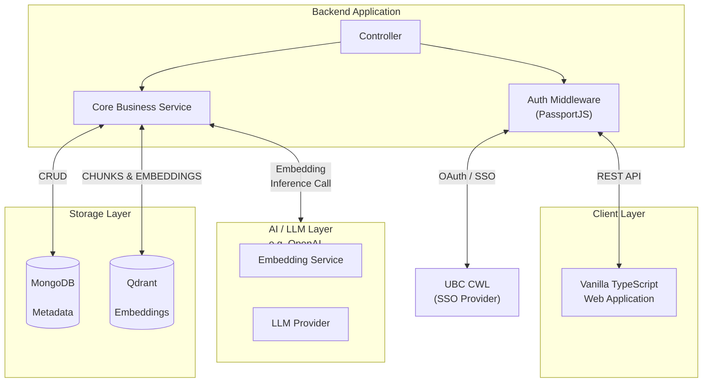

# Main Architecture

```prerequisites

```

```relevant readings

- [JavaScript event loop](https://nodejs.org/learn/asynchronous-work/event-loop-timers-and-nexttick)

```

EngE-AI is built using vanilla typeScript pattern (client-server architecture) across the frontend and backend (Typescript, HTML, CSS). As described in [Agentic Engineering](/docs/logistics/agentic-engineering), we chose this stack because current coding models are trained heavily on this techstack, and can reason about our current codebase, the problems, and plausible solutions. We also use AI-assisted coding tools along with human-in-the-loop workflow to develop faster alhtough human involvement is required. This makes the combination of a well-known stacks and well-trained AI coding assistance a best fit for the development process. 


By the end of this section you should be able to:

1. List the tech stack we currently use
2. Describe how the major layers connect

## List of Tech Stacks

The technologies we are currently using:

1. TypeScript (frontend and backend)
2. HTML
3. CSS
4. MongoDB
5. Qdrant (vector database)
6. Passport.js (middleware and authentication)
7. UBC LTIC facade LLM toolkit

## Architecture Overview

The overall architecture is summarized below.



By the end of this module you should understand how these layers fit together—enough to follow feature-specific documentation and implementation work.

## References
